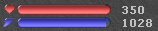

# TibiaFlask
> Tibia Pixel Based Automatic Flask and Spell Dispatcher

TibiaFlask is heavily inspired on [TibiaAuto12](https://github.com/MuriloChianfa/TibiaAuto12) from [MuriloChianfa](https://github.com/MuriloChianfa).
[TibiaAuto12](https://github.com/MuriloChianfa/TibiaAuto12) is a more feature complete Tibia Bot. Check it out.

I made TibiaFlask to be an Automatic Healer and Support Dispatcher focused on performance and accuracy. TibiaFlask logic is and will ever be focused on features that meet this objective.

Do not expect an user friendly interface though.

TibiaFlask will also be always cross-platform as I play sometimes on Windows and Linux, so it will be tested on both.

## Installation and Launch
### Windows

Run `install.bat`.

It will make a Python Virtual Environment and install the **required** dependencies.

To run the program, either run the Virtual Environment manually and run `main.py` or run `start.bat`.

`start.bat` will activate the Virtual Environment and run `main.py`.

Detailed instructions will come further.

TLDR:
- Run Tibia Client and Login into a character
- Run your Client Mirror
- Run `start.bat`.

**Windows screenshoting** can and is made unfocused. Do not minimize your Client Mirror, just make it be underneath your Tibia Client.

- Run configuration by pressing `ctrl+shift+2`.
- Enable TibiaFlask by pressing `ctrl+shift+1`. Hotkeys and preferences can be set at `preferences.yml`.

**There are stil no automated installation and run scripts for Windows.**
Feel free to run it manually for now.

### Linux

Same instructions as Windows users except you will run `install.sh` & `start.sh` instead of `*.bat` files.

## How to Use
### Windows
Tibia on windows does not enable user screenshots to be made by third-party.

You will need a screen mirror and for that is recommended to use **OBS** `Game Capture` on Tibia Client -> `Preview Window`.

Take this new mirrored window and maximize it below your Tibia Client window. 

It *should* look identical except the window title will be different.

### Linux
Linux Tibia Client doesn't block third-party screenshoting, so, all you have to do is:

- Open your Tibia Client and **LOG-IN** to your character.
- Run TibiaFlask through `start.sh`.
TibiaFlask will detect your client for the first time only if there is a character logged-in.
- Head over to your client (make it focused, clicking on it).
- Press the configuration hotkey (defaults to `ctrl+shift+2`).
- TibiaFlask will locate your status bar and be ready to be enabled.
- Enable TibiaFlask (hotkey defaults to `ctrl+shift+1`).

### General Requirements
**Make sure** you have tibia status bar enabled.

It can be positioned wherever you want. TibiaFlask handles detecting its position.

#### You will also want hotkeys properly defined for life potions, mana potions, healing spells and support features.
- F1~12 are recommended hotkeys.
- Define your hotkeys and trigger percentage at `preferences.yml`.
- Default settings are testing settings for higher leveled EKs.